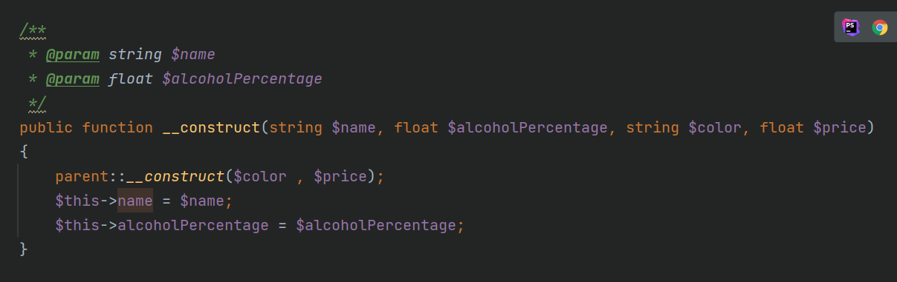

# oop-introduction
This repository consists of 7 exercises to learn and understand object-oriented programming in PHP.

## Exercise 1:
- An object is an instance of a class that contains all the methods and properties of that class
- To create an object, we have to define a constructor in the class. To trigger the constructor, use ```new```
  - ```$obj = new className(<List of parameters to pass to constructor>)```
- To access a class property within the class , use ```$this->propertyName```
- Methods are functions within the class.
  - to access methods: ```$obj->method()```
- annotations:
  - [PHP annotations are basically metadata which can be included in the source code and also in between classes, functions, properties and methods. They are to be started with the prefix @ wherever 
  they are declared and they indicate something specific.](https://www.educba.com/php-annotations/)
  - example: 
## Exercise 2:
- To create an extension of a class: ```class child extends parent```
  - children of a class inherit all the properties and methods of their parent.
## Exercise 3:
- When u make a property public you can't have direct access to them form outside the class
  - Define getters and setters
  - use ```$obj->getProperty``` instead of ```$obj->property```
- Children can't have direct access to the parent's private properties. They also need to use getters and setters.
- Constructors need to be public, otherwise ... how can we create an object?
## Exercise 4:
- To make the properties accessible to children, we can make them protected instead of private.
- Protected properties are still only accessible through getters and setters outside the class.
## Exercise 5:
- Using other functions to access private properties.
## Exercise 6:
- To define a constant property : ```const PROPERTYNAME```
  - No type needed
  - No $ needed
  - Can access using class name directly : ```className ::constantName```
- There are multiple ways to access const from child class:
  - ```parent::CONSTNAME;```
  - ```self::CONSTNAME;```
  - ```className::CONSTNAME```
  